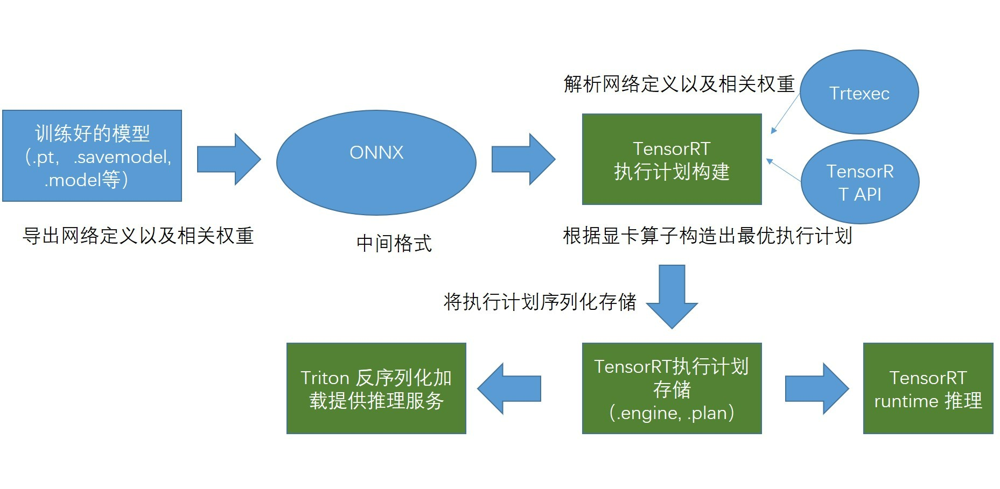
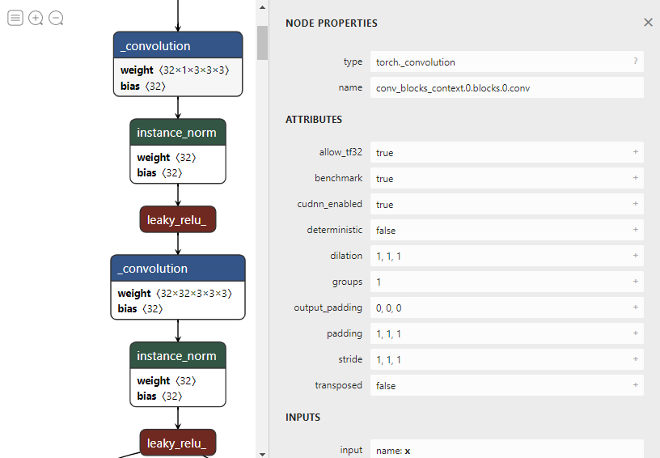
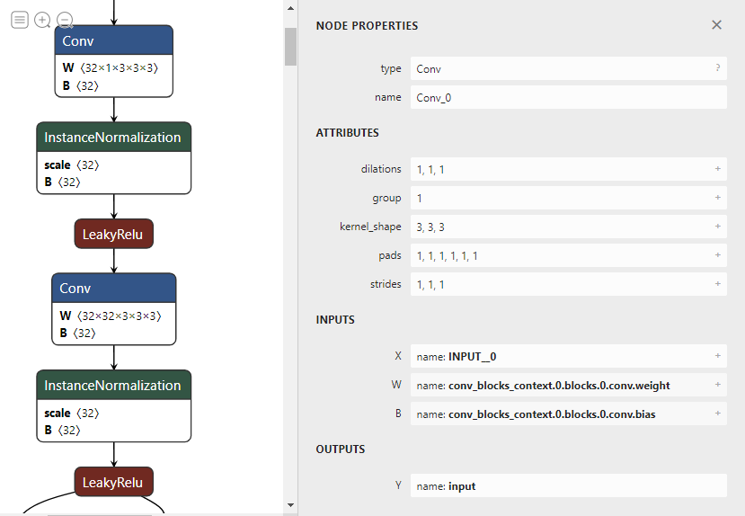
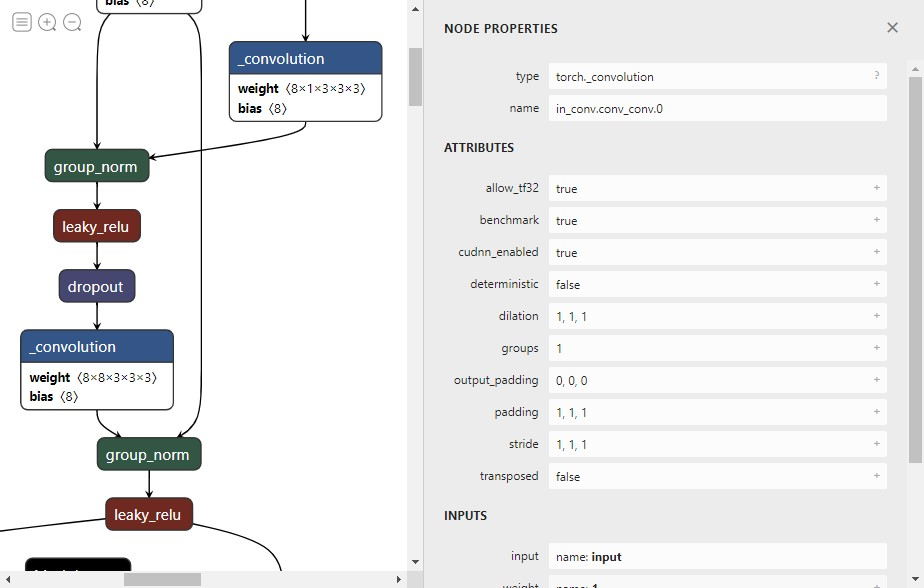
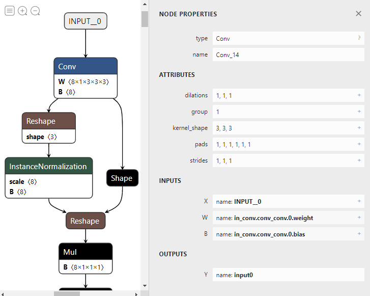
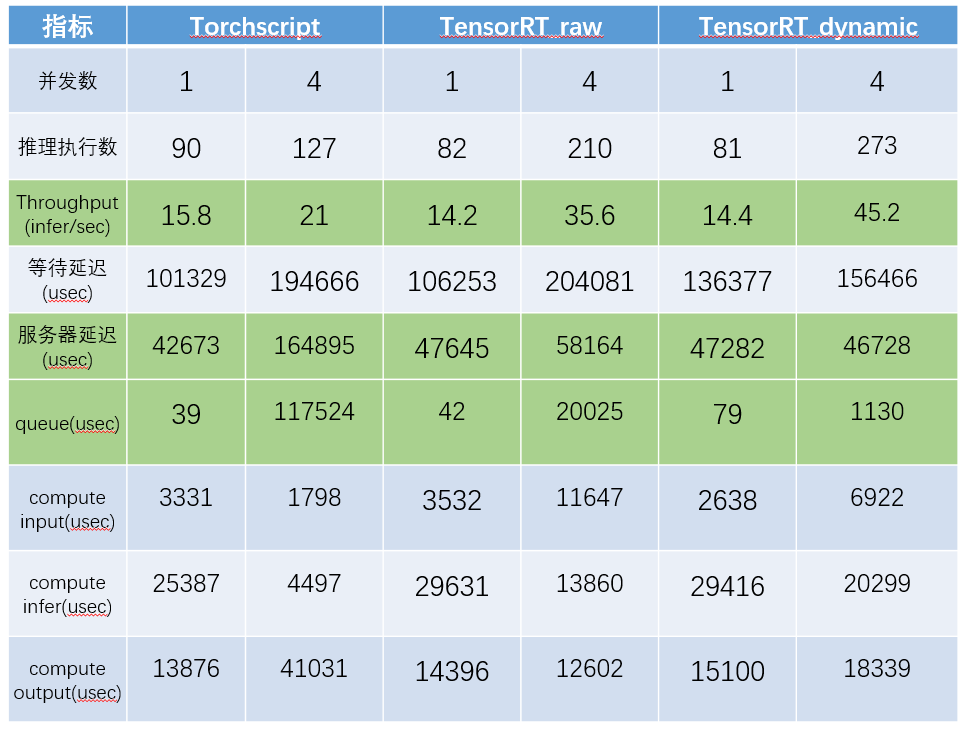
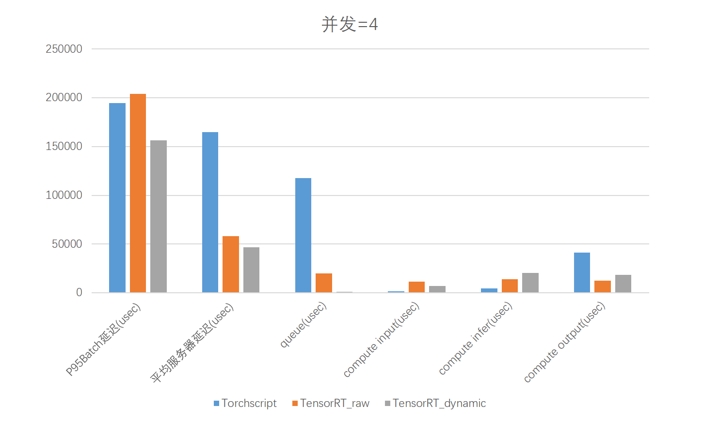

# 技术可行性分析


## 模型转换加速流程
* 导出网络定义以及相关权重；  
* 解析网络定义以及相关权重；  
* 根据显卡算子构造出最优执行计划；  
* 将执行计划序列化存储；  
* 反序列化执行计划；  
* 进行推理；  


## 推理加速技术路线



## 实现流程

1. PyTorch(.pt)->ONNX(.onnx)[参考](Pytorch%E5%AF%BC%E5%87%BAONNX.md)
```
# torchToOnnx.py
import torch
torch_model = torch.jit.load("/work/wuzihao/ibotModelDeploy/modelTrans/result/airway/model.pt") # pytorch模型加载
batch_size = 1  #批处理大小
input_shape = (1, 1, 128, 160, 112)   #输入数据

jit_layer = torch_model
print(jit_layer.graph)   # 计算图输出
print(jit_layer.code) 

# set the model to inference mode
torch_model.eval()

x = torch.randn(1, 1, 128, 160, 112)		# 生成张量
export_onnx_file = "../result/airway/airway.onnx"					# 目的ONNX文件名
with torch.no_grad(): 
    torch.onnx.export(torch_model, x,
                    export_onnx_file,
                    opset_version=9, 
                    input_names=["INPUT__0"],		# 输入名
                    output_names=["OUTPUT__0"],	    # 输出名
                    dynamic_axes={"INPUT__0":{0:"batch_size"},		# 批处理变量
                                    "OUTPUT__0":{0:"batch_size"}})
```

2. PyTorch算子与ONNX算子的符号函数定义（可选）
```
    # symbolic.py
    import torch 

    # Pytorch 算子实现
    class Model(torch.nn.Module): 
        def __init__(self): 
            super().__init__() 
    
        def forward(self, x): 
            return torch.asinh(x) 
    
    from torch.onnx.symbolic_registry import register_op 

    # onnx算子符号函数定义
    def asinh_symbolic(g, input, *, out=None): 
        return g.op("Asinh", input) 
    
    # 注册绑定对应的ONNX op 算子
    register_op('asinh', asinh_symbolic, '', 9) 
    
    model = Model() 
    input = torch.rand(1, 3, 10, 10) 
    
    # 算子结构导出
    torch.onnx.export(model, input, 'asinh.onnx', opset_version=9) 
```


3. trtexec执行引擎构建（__.onnx->.plan__）
```使用TensorRT官方容器提供的trtexec引擎构建工具（__在执行推理的GPU上进行构建__）
$ //启动镜像，注意容器各版本号对齐
$ docker run --gpus '"device=0"' -it --rm -v /work:/work nvcr.io/nvidia/tensorrt:22.04-py3

$ 开启--best选项精度可能会得不到保障（fp16+int8混合使用）
$ //静态batchsize的engine生成。
$ trtexec   --onnx=/work/wuzihao/ibotModelDeploy/modelTrans/result/airway/airway.onnx \
            --saveEngine=/work/wuzihao/triton/model_repository/airway_trt/1/model.engin \
            --explicitBatch  \
            --workspace=4096 \
            --best 

$ //动态batchsize的engine生成。
$ trtexec   --onnx=/work/wuzihao/ibotModelDeploy/modelTrans/result/airway/airway.onnx \
            --saveEngine=/work/wuzihao/triton/model_repository/airway_trt/1/model.engin \
            --workspace=4096 \
            --best \
            --minShapes=INPUT__0:1x1x128x160x112 \
            --optShapes=INPUT__0:4x1x128x160x112 \
            --maxShapes=INPUT__0:8x1x128x160x112 

```

## 过程保障及结果验证

1. 网络结构可视化（__.pt->.onnx__）
   __Netron__:核对网络计算图，各算子的连接、属性、输入输出等 [Netron](https://netron.app/)  
    |网络|.pt|.onnx|算子支持(ATen->ONNX)|
    |:--:|:--:|:--:|:--|
    |airway|||一对一:   _convolution->Conv,instance_norm->InstanceNormalization...|
    |heart|||一对多: group_norm ->InstanceNormalization,Mul,Add...|
2. 推理输出误差计算（__.pt->.onnx__）
   ```
    # check.py
    import onnxruntime as ort
    import torch
    from torch import nn
    import numpy as np

    model = torch.jit.load("/work/wuzihao/ibotModelDeploy/ibotModel/pulmonary/0.1/heart/1/model.pt") # pytorch模型加载

    ort_session = ort.InferenceSession('/work/wuzihao/ibotModelDeploy/modelTrans/result/heart/heart.onnx') # onnx模型加载

    input = torch.rand(1, 1, 160, 176, 176)  # 输入初始化

    torch_output = model(input).detach().numpy()   # torch模型输出计算

    ort_output = ort_session.run(None, {ort_session.get_inputs()[0].name: input.numpy()})[0]  # onnx模型输出计算

    print(torch_output.shape)
    print(ort_output.shape)

    print(np.allclose(torch_output, ort_output, rtol=0.0001,atol=0.0009))       # 对接近和相对接近。多个都接近，那么返回接近，绝对忍耐加上相对忍耐
   ```


3. 推理性能测试(__.pt->.plan__)
   当前实验结果均基于并发请求数为4的前提下
   基于TorchScript模型推理测试
   基于TensorRT模型推理测试
   基于TensorRT支持动态批处理模型
   
   
   

4. 推理结果可视化(__.pt->.plan__)
   
   

## 结论
__一. 模型转换后，在面对请求并发量为1的推理请求的处理上，并不存在明显性能优势__

__二. 当面临高并发的请求时，TensorRT开始展现出优越性，吞吐量有了明显提升，同等时间内执行的推理请求在使用了动态批处理机制后，吞吐量翻倍。__

__三. 适用于处理客户端高并发请求。__


# Engine模型安全性验证

### 模型仓库现有模型：
 
- onnx 

- engine

### 模型安全性

- onnx模型的结构可以被直接解析，会造成模型的泄漏。安全性差。

- engine模型是由onnx模型经过层融合等一系列操作得到的，其网络结构与onnx模型并不相同。通过对engine模型结构的解析无法溯源到onnx。

### engine模型安全性验证

下图是同一模型onnx和engine的输入的网络结构


因为onnx模型的安全性得不到保证，建议在生成engine后删除onnx。

### engine模型的风险

在同硬件环境下engine 是可以迁移使用的，因此要限制对engine模型的拷贝和转移。


### 网上关于模型加密方案

| 方法描述                             | 加密和解密                                               | 优点                     | 缺点           |
| ------------------------------------ | -------------------------------------------------------- | ------------------------ | -------------- |
| 使用专用加密库对模型加密，使用时解密 | 用 openssl或者crypto++                                   | 加密算法越强，安全性越高 | 解密会浪费时间 |
| 设置假路径放置假模型                 | 显式的模型路径中放置无效模型，真正的模型放置在另一个地方 | 不影响运行速度           | 易于破解       |
| 自定义的外部文件加密方式             | 直接对模型文件夹进行加密                                 | 简单                     |                |
| 部署到云端给api接口调用              |                                                          | 安全性高                 | 当前场景不实用 |


