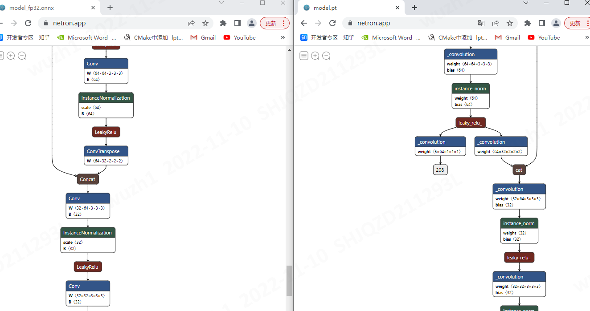
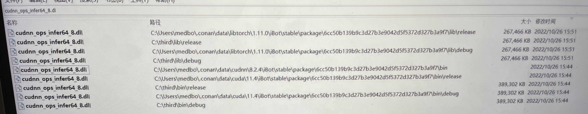
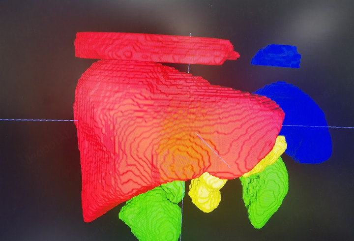

# TensorRT windows环境下问题汇总(持续更新)

##  问题

1. ONNX模型转化问题
2. 当前开发环境中库冲突的问题
3. 同步推理和异步推理结果不同

### 1. ONNX模型转化问题

**问题描述：**

成功由TorchScript模型导出ONNX后，计算图校验和推理校验都与TorchScript一致，但在使用Engine进行推理时出现内存溢出。(下图右侧为出错的肝模型结构网络结构图)

Error Code 1: Cuda Runtime (an illegal memory access was encountered)

原因：模型有多个输出，但现在的代码在进行内存开辟时只会开辟一个输出的内存，从而引起内存异常。

### 2. 当前开发环境中库冲突的问题

问题描述：不同的库中有相同但版本不同的.dll文件

以libtorch和tensorrt为例，两边都有同名但版本不同的.dll文件

### 3. 同步推理和异步推理结果不同

**问题描述：**

tensorRT 提供了两个函数用于推理 分别是 enqueue 和 execute 每个函数各有两个版本

|      | 版本1   | 版本2     |
| ---- | ------- | --------- |
| 同步 | execute | executeV2 |
| 异步 | enqueue | enqueueV2 |

但在使用中发现，在同步推理时会导致细精度肝模型的结果出现问题。

推理出来的肝会多出来一块。使用异步推理函数时不会产生这个问题。

3.多次推理会有空数据产生的问题

问题描述：在执行多次推理后，有一次推理出的数据是空的，再次运行推理数据又恢复正常。

