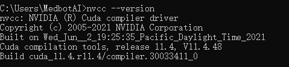
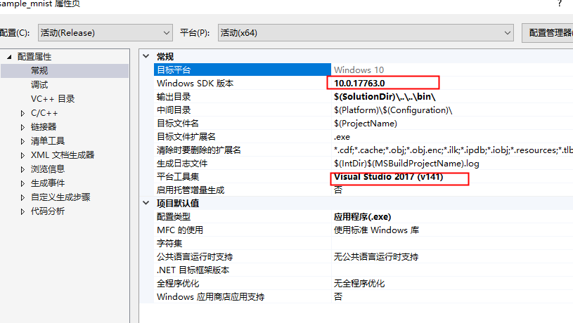
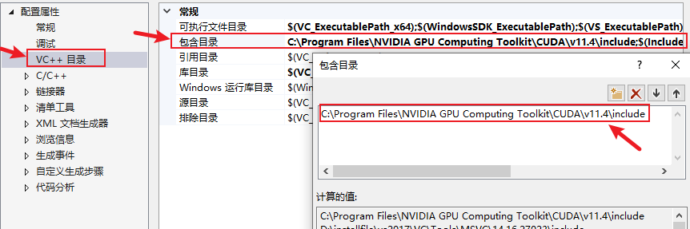
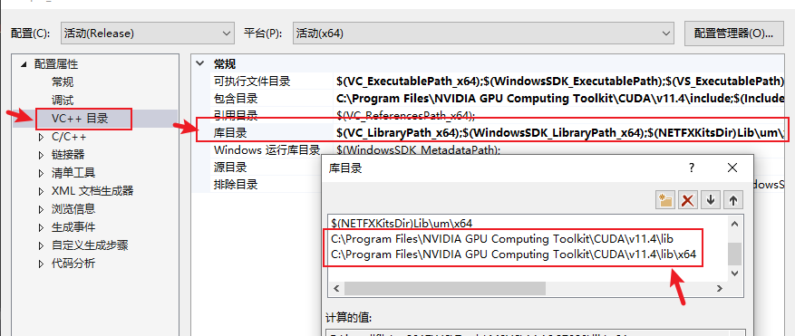
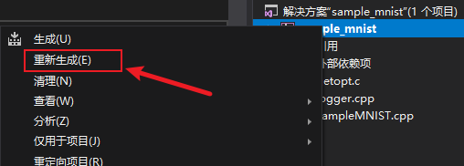
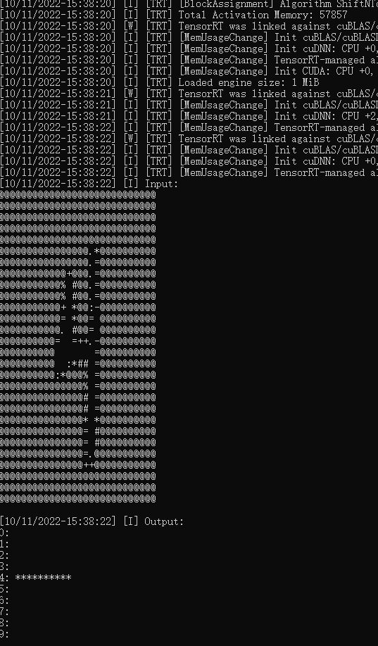

# windows环境配置文档

## 环境

| 文件     | 版本    |
| -------- | ------- |
| TensorRT | 8.2.4.2 |
| CUDA     | 11.4.0  |
| cuDNN    | 8.2.4   |

- 系统版本： windows10
- 开发工具： Visual Studio 2017

## 安装

### 1.文件下载

TensorRT [下载链接](https://developer.nvidia.com/nvidia-tensorrt-download)

CUDA [下载链接](https://developer.nvidia.com/cuda-toolkit-archive)

cuDNN [下载链接](https://developer.nvidia.com/rdp/cudnn-archive)

[TensorRT CUDA cuDNN 版本对应关系表](http://10.70.21.10:8888/share/triton/-/blob/master/doc/TensorRT%E7%9F%A5%E8%AF%86%E5%BA%93%E5%BB%BA%E8%AE%BE/TensorRT_%E4%B8%8E_CUDA_%E5%92%8CcuDNN%E7%9A%84%E7%89%88%E6%9C%AC%E5%AF%B9%E5%BA%94%E5%85%B3%E7%B3%BB%E8%A1%A8.md)

### 2.安装

- **CUDA安装**：运行下载的CUDA的exe文件，一直点下一步直至安装结束。

- TensorRT 和 cuDNN直接解压文件即可。

### 3.环境配置

- 打开CUDA的安装路径，默认路径为C:\Program Files\NVIDIA GPU Computing Toolkit\CUDA\v11.4
- 将cuDNN和TensorRT中bin，include，和lib目录下的文件都复制到CUDA bin，include，lib目录下

### 4.验证

#### cuda验证

- 在cmd中执行nvcc --version 成功显示CUDA版本即为安装成功

#### TensorRT验证(成功执行TensorRT中的sampleMNIST)
- 使用Visual Studio 2017 打开 sample_mnist_sln,然后对Vsiual Studio 2017 进行环境配置

- 配置完毕后重新生成该文件

- 最后在cmd中执行sample_mnist.exe --datadir=path\TensorRT-8.2.4.2\data\mnist\，查看是否成功进行识别

