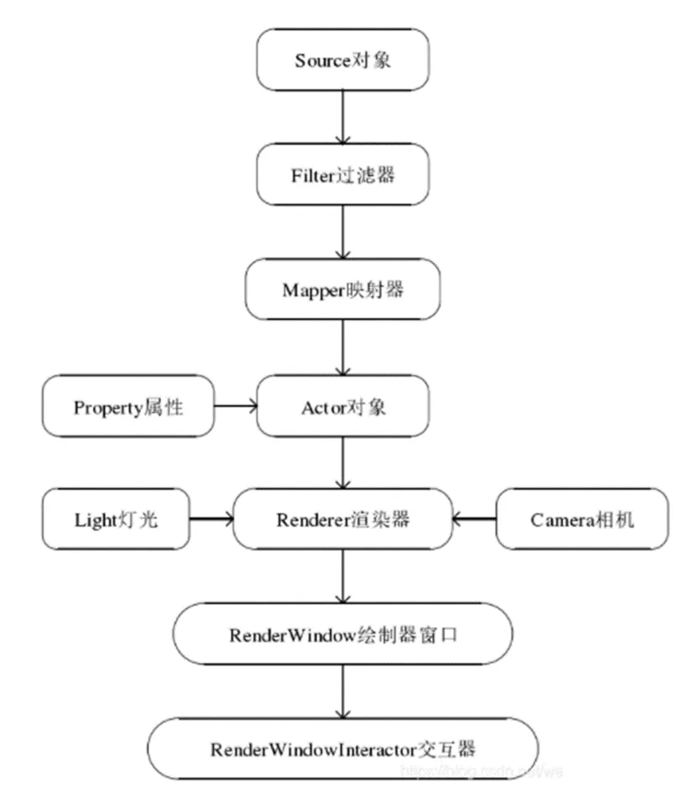

# Vtk基础

## 什么是Vtk
Vtk是三维计算机图形，图像处理及可视化的工具包。

## Vtk渲染流程

Vtk进行图像渲染的基本流程如下：

- **source(数据源)：** 各类图像数据

- **mapper(映射器)：** 把不同的数据类型，转换成图像数据

- **actor(演员)：** 执行渲染mapper的对象

- **renderer(渲染器):** 用于渲染图像

- **renderwindow(窗口):** 可以理解为用于成像的一个平面

- **interactor(交互):** 在渲染窗口上交互，用于获取渲染窗口上发生的鼠标，键盘事件，提供了独立于平台的与渲染窗口进行交互的机制

### 体数据渲染与几何数据渲染

体绘制：有时又称作三维重建，它能够通过设置不透明度值来显示提数据内部不同成分的细节

### vtkVolumeMapper 类

- vtkVolumeMapper是所有体绘制Mapper类的虚基类，提供接口函数，并由其子类实现具体功能。

#### vtkVolumeRayCastMapper
