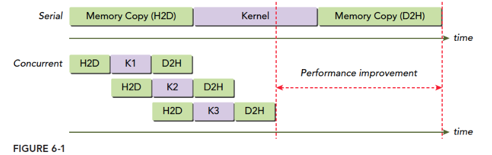

# Cuda流

一般来说CUDA程序有两个几倍的并发：
* 内核级并行
* 网格级并行（多个内核）

提升内核级并行可以通过编程模型、执行模型和内存模型，而提升网格级并行的方式主要是依靠CUDA流

#### 流和事件

一个完整的CUDA程序包含以下三种操作：
- 主机与设备间的数据传输
- 核函数启动
- 其他的由主机发出的设备执行的命令

这些操作中有些是异步的，**执行顺序也是按照主机代码中的顺序执行**(但是异步操作的结束不一定是按照代码中的顺序的)
流能封装这些异步操作，并保持操作顺序，使这些操作在同一个流中排队。

**一个流中有着严格的执行顺序，但是多个流之间互不干扰。** 假设一个流启动一个内核，那么多个流同时启动多个内核，就是网格级的并行。

CUDA API分为同步执行和异步执行两种:

- 同步行为的函数会阻塞主机端线程直到其完成
- 异步行为的函数会在调用后立刻把控制权返还给主机

异步行为是流式构建网格级并行的支柱。

上述关流，网格级并行只是在软件层面提出的概念，如果硬件本身没有那么多资源(ple总线和SM的数量是有限的)，那我们认为并行的指令也必须排队等待。

##### 1.CUDA流

流分为两种：
- 空流：没有显式声明的流
- 非空流：显示声明的流

因为空流没有名字，因此无法对其进行并行级操作

**下面是使用CUDA流并发会用到的API**
```c++
// （1）异步内存拷贝
cudaError_t cudaMemcpyAsync(void* dst, const void* src, size_t count,cudaMemcpyKind kind, cudaStream_t stream = 0);

// （2）声明一个非空流
cudaError_t cudaStreamCreate(cudaStream_t* pStream);

// （3）内存开辟
cudaError_t cudaMallocHost(void **ptr, size_t size);
cudaError_t cudaHostAlloc(void **pHost, size_t size, unsigned int flags);

// （4）在核函数启动时加入一个流配置参数，声明核函数属于哪个流
kernel_name<<<grid, block, sharedMemSize, stream>>>(argument list);

// （5）回收流的资源
cudaError_t cudaStreamDestroy(cudaStream_t stream);

// （6）查询流的执行状态，执行成功cudaSuccess否则返回cudaErrorNotReady。
// 会阻塞主机，直到流完成
cudaError_t cudaStreamSynchronize(cudaStream_t stream);
// 立即返回 
cudaError_t cudaStreamQuery(cudaStream_t stream);

```

**下面是一个多流调度的例子**
```c++
for (int i = 0; i < nStreams; i++) {
    int offset = i * bytesPerStream;
    // 数据拷贝到GPU 异步
    cudaMemcpyAsync(&d_a[offset], &a[offset], bytePerStream, streams[i]);
    // 执行核函数
    kernel<<grid, block, 0, streams[i]>>(&d_a[offset]);
    // 数据拷贝回CPU 异步
    cudaMemcpyAsync(&a[offset], &d_a[offset], bytesPerStream, streams[i]);
}
for (int i = 0; i < nStreams; i++) {
    cudaStreamSynchronize(streams[i]);
}

```

这段代码中每个流都执行了 cpu->gpu(H2D)  执行核函数(Kn) gpu->cpu(D2H). 其执行状态如下图：



在图中可以看出多个流的数据传输并不在同时发生，造成这种现象的原因是ple总线是共享的，当第一个流占据了总线，后面的流就要等待。

[更多内容](https://face2ai.com/CUDA-F-6-1-%E6%B5%81%E5%92%8C%E4%BA%8B%E4%BB%B6%E6%A6%82%E8%BF%B0/)