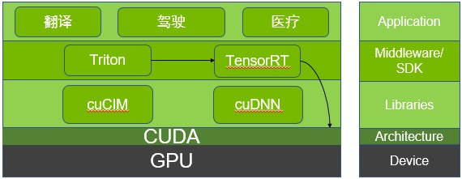

# NVIDIA生态体系

## NVIDIA推理生态体系

- GPU: 一个为了计算而生的硬件。
- CUDA: 一个并行计算框架，打通程序运行时CPU和GPU的壁垒，将逻辑操作交给CPU，计算操作交给GPU,从而达到加速的目的。
- cuDNN: Nvidia官方针对与神经网络提供的加速包，基于cuda实现。
- TenosrRT: 能够提高本地部署的模型的吞吐量，实现推理提速。
- Triton: 能够提高服务器端部署的模型的吞吐量，实现推理提速。
