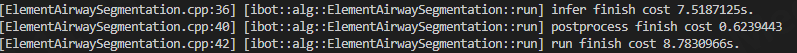
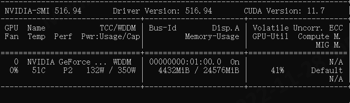

# 算法性能优化方案

当前ibotSever运行时长如下图(以Airway分割为例)：

在整个运行的时长中推理占据了大部分的时长。 因此对推理部分的优化十分有必要。

GPU资源使用如图所示(以Airway分割为例)：

因此后续性能优化应主要聚焦于两件事：

- 推理阶段的性能
- 前处理阶段的性能

| 方案                                             | 状态   |
| ------------------------------------------------ | ------ |
| windows环境使用TensorRT进行部署                  | 已完成 |
| linux环境使用Triotn进行部署                      | 已完成 |
| Triton 模型仓库中的模型都置换成TensorRT Engine   | 未开始 |
| VTK 渲染性能优化 gpu 调研    cpu库和gpu库        | 未开始 |
| 多线程推理（并行计算库调研） 基建                | 未开始 |
| 多patch推理                                     | 未开始 |
| 前处理性能优化 （DALI CUCIM ITK 图像处理调研  ） | 未开始 |
| 数据拷贝方式优化                                | 未开始 |
| 重写CUDA算子提升GPU利用率                       | 未开始 |

### 1.推理阶段加速

#### 1.1 提升推理的吞吐量

- 使用TensorRT 进行windows环境下的模型部署
- 使用Triton来部署模型，且模型仓库中放置转换完毕的Engine模型

- 多patch推理  
- 多线程推理
- 重写CUDA算子：上述方案中关于底层GPU的算力的调用使用的都是英伟达cuDNN中封装好的算子，结合本地算法的具体执行情况，可通过CUDA编程重写CUDA算子，从而是GPU资源的利用更加充分。

#### 1.2 减少数据拷贝次数

在推理的整个流程中减少不被要的内存拷贝，最好是整个流程都在GPU中完成。

### 2.数据前处理加速

英伟达官方提供了DALI 这个库，在使用英伟达GPU设备的机器上可以对数据前处理进行加速，主要方法还是将CPU上的计算转移到了GPU中。

关于DALI更多的描述可[点击此处](https://developer.nvidia.com/zh-cn/blog/rapid-data-pre-processing-with-nvidia-dali/)查阅