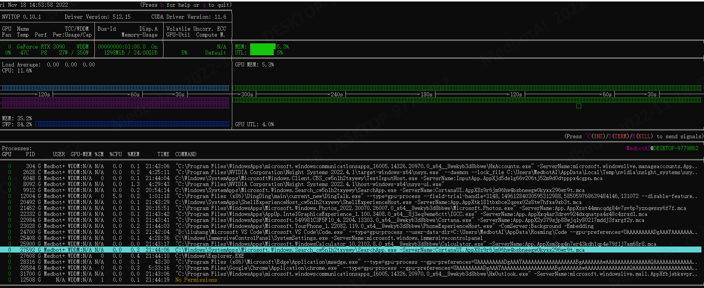

## windows环境下进程性能统计方案

### 需要统计的资源

#### 1.cpu性能

统计指标：

- CPU资源占用

- 内存资源占用

#### 2.GPU性能

统计指标：

- GPU资源占用

- 显存资源占用

### 资源统计工具（可视化工具）
监测工具
windows 环境下使用 nvitop 作为资源监测的工具。
使用 nvitop 进行监测的原因在于它能够很直观且动态的显示出当前cpu和gpu的使用情况，且windows环境中并没有很多类似的工具。

#### 1.界面



算法各个性能衡量资源对应关系如下表：
| 指标        | 对应项  | 
| -----------| -------| 
| 利用率     | MEM  |     
| 内存/显存  | UTL  |  

#### 2.安装
正常网络情况下安装方法
##### 从 GitHub 获取并安装最新版 (推荐)
```shell
 pip3 install git+https://github.com/XuehaiPan/nvitop.git#egg=nvitop
```

公司网络安装方法
```shell
#step1  在49服务器中执行下面命令获取源码
git clone --depth=1 https://github.com/XuehaiPan/nvitop.git

#step2  将下载好的源码拷贝到windows机器中

#step3  依次执行下面的命令
cd 文件存放路径/nvitop
pip3 install . #注意这里有个小数点

#step4 在文件存放路径/nvitop路径下执行下面命令看是否成功出现界面
python -m nvitop 
```


可能出现的问题：

nvitop是用python开发的，需要依赖一些库。

根据返回的缺失信息依次安装这些库即可
```shell
pip install psutil
pip install cachetools
pip install termcolor
pip install windows-curses
```

#### 3.使用
在文件存放路径/nvitop路径下执行。未配置环境变量使用前请执行下面代码：
cd   PATH/nvitop
| 命令        | 作用  | 
| -----------| -------| 
| python -m nvitop     | 开启资源监测  |     
| python -m nvitop  -1   | 显示当前所有可用的gpu设备信息 |  
| python -m nvitop  -1 -o 0 1   | 之查看GPU0和GPU1的信息 |
| python -m nvitop  -ov   | 只显示 `CUDA_VISIBLE_DEVICES` 中的 GPU |
上述只是基础命令，GitHub上有更详细的描述，如需要其它操作，可查阅[github](https://github.com/XuehaiPan/nvitop)。

### 资源统计工具（C++ API）

#### 1.获取当前进程号

方法：使用getpid()函数 使用该函数会返回当前进程的ip。

- windows 环境下导入 process.h 这个头文件。

- Liunx 环境导入 unistd.h 这个头文件。

**代码实现：**

```c++
#ifdef _WIN32
#include <process.h>
#else
#include <unistd.h>
#endif
int main()
{
    int iPid = (int)getpid();
    std::cout<<"The process id is: "<<iPid<<std::endl;
    return 0;
}
```
